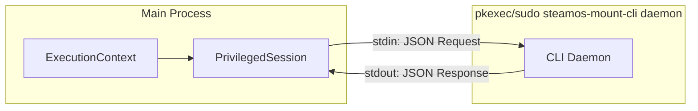
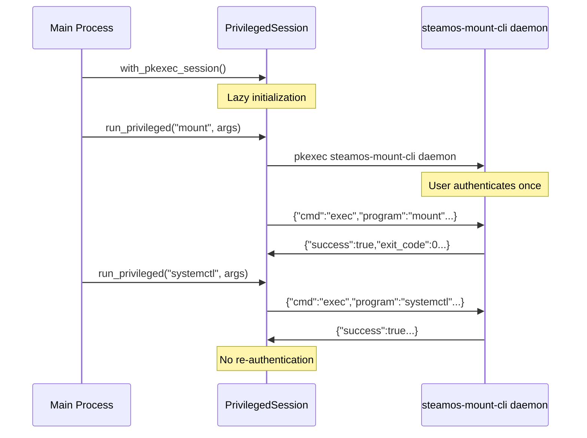

# steamos-mount Software Design Document

[中文 (Chinese)](SOFTWARE_DESIGN_zh.md)

This document details the design philosophy, technical architecture, and core implementation details of the `steamos-mount` tool. This project aims to solve the pain point for SteamOS users mounting NTFS/exFAT disks in Game Mode and recognizing them as Steam game libraries, focusing on **Ergonomics**, **Safety**, and **Automated Experience**.

## 1. Design Goals & Principles

- **Ergonomics First**: Hide complex Linux mount parameters through intelligent Presets, making configuration easy for non-technical users.
- **Backend First Architecture**: Decouple core logic from UI, supporting multiple frontends like TUI, GUI (Desktop), and Decky Plugin (Game Mode) via a unified Core Binary.
- **Safety & Stability**:
  - Core logic written in Rust to ensure memory safety.
  - Modifications to `/etc/fstab` must be Idempotent and include backup mechanisms.
  - Intelligently handle "Dirty Volume" states to prevent data corruption.
- **SteamOS Native Compatibility**: Adhere to SteamOS immutable filesystem characteristics, utilizing `/home` directory and Systemd mechanisms for persistence.

---

## 2. Software Architecture Design

Adopting a **Core-Client** separation architecture, where core logic sinks down and the UI layer is responsible only for display and interaction.

### 2.1 Technology Stack

- **Core Library + CLI**: `Rust`
  - **Responsibilities**: Disk scanning (`lsblk`), Fstab parsing & writing, `ntfsfix` repair, Steam VDF injection, Systemd control.
  - **Advantages**: High performance, type safety, easy cross-process invocation.
- **TUI (Terminal Interface)**: `Rust` + `Ratatui`
  - **Scenarios**: SSH remote management, Konsole, and terminal fallback within Decky plugins.
- **Game Mode GUI**: `Python` (Decky Backend) + `React` (Frontend)
  - **Scenarios**: Native experience in Game Mode. The plugin invokes `steamos-mount-cli` downloaded by `install.sh` (Decky CI lacks a Rust toolchain).
- **Desktop Mode GUI**: `Rust` + `Tauri`
  - **Scenarios**: Full configuration tool in Desktop Mode. UI components are maintained locally (not shared with Decky).

```plaintext
steamos-mount/
├── .git/
├── .gitignore
├── mise.toml                  # [Manager] Environment management
├── Cargo.toml                 # [Rust Workspace] Aggregates all scattered Cargo.toml
├── pnpm-workspace.yaml        # [JS Workspace] Aggregates all package.json
├── pyproject.toml             # [Python Workspace] Aggregates all scattered pyproject.toml
├── apps/                      # [Executable App Layer]
│   ├── cli/                   # Command-line interface
│   ├── tauri-app/             # Desktop GUI
│   │   ├── src-tauri/         # [Rust] Depends on packages/core
│   │   └── src/               # [React] Local UI components (not shared with Decky)
│   │
│   ├── decky-plugin/          # Game Mode Plugin
│   │   ├── src/               # [React] Local UI components
│   │   └── py_modules/        # [Python] Decky Python entry point
│   │
│   └── tui-app/               # [Rust] Pure Terminal App
│       └── src/               # Depends on packages/core
│
└── packages/                  # [Shared Library Layer]
    └── core/                  # [Rust] Core business logic (lsblk, fstab, mount)
```

### 2.2 Data Flow

1.  **Scan**: Core calls `lsblk` to get disk information in JSON format (including physical properties like ROTA, TRAN, RM).
2.  **Present**: UI reads structured data returned by Core (including Label, UUID, FSTYPE, MOUNTPOINT, ROTA, TRAN, REMOVABLE).
3.  **Configure**: UI requests mount suggestion from Core. Core analyzes device properties to recommend Connection Type and Media Type. User confirms or fine-tunes parameters.
4.  **Execute**: Core receives instructions -> Backups fstab -> Writes fstab -> Reloads Systemd -> Mounts -> (Optional) Injects Steam Library -> Restarts UI.

### 2.3 Repository Notes (Development)

- **Main repo**: https://github.com/aitiotekt/steamos-mount
- **Decky subtree repo**: https://github.com/aitiotekt/steamos-mount-decky
- **Why subtree**: decky-plugin-database uses submodules that can only target repo roots, so the Decky plugin is synced as a git subtree.
- **UI components**: Tauri and Decky UIs do not share a UI kit due to Decky pipeline constraints.

---

## 3. Core Solution Details

### 3.1 Mount Point Strategy

- **Path Standard**: Unify under `/home/deck/Drives/<Label_or_UUID>`
  - **Why not `/mnt`**: System updates clear `/mnt`, causing mount point loss.
  - **Why not `/run/media`**: This is `udisks2` dynamic mount directory and is tmpfs (RAM disk), unable to achieve persistence with fstab, and prone to permission conflicts.
  - **Advantages**: `/home` partition is retained during SteamOS upgrades, and Flatpak apps have default access permissions.
  - **Conflict Handling**: If Label is empty or duplicate, automatically downgrade to use the first 8 characters of UUID as directory name.

### 3.2 Disk Identifiers

- **Recommended Strategy**: Provide both UUID and PARTUUID choices, with explanation in UI.
  - **UUID (Default Recommended)**: Bound to filesystem. Invalid after formatting, but persists if partition moves. Suitable for most users.
  - **PARTUUID**: Bound to partition table. Valid even after formatting filesystem (as long as partition isn't deleted). Suitable for advanced users.
  - **Note**: Write config should prioritize blkid got value, and must check `/dev/disk/by-uuid/<UUID>` or `/dev/disk/by-partuuid/<PARTUUID>` is exist, to be compatible with `/dev/disk/by-uuid/` and `/dev/disk/by-partuuid/` path lookup.

### 3.3 Filesystem Parameters & Presets

The tool should primarily provide presets based on filesystem, storage media, and usage scenario; however, advanced users can manually fine-tune parameters, such as toggling specific options or adjusting values.

#### General Configuration

- `uid=1000,gid=1000`: Force mapping ownership to `deck` user, solving issue where NTFS/exFAT lack POSIX permissions preventing Steam from writing.
- `umask=000`: Grant 777 permissions to ensure Proton compatibility layer has no permission blockers.
- `nofail`: Do not block system boot if mount fails.
- `rw,noatime`: Reduce metadata writes.

#### Filesystem Presets

**Filesystem: ntfs**

- `ntfs3`: Use kernel driver, high performance.
- `prealloc`: (NTFS only) Pre-allocate space, reduce fragmentation, optimize large game downloads.

**Filesystem: exfat**

- `exfat`: Use exFAT driver.

#### Storage Media Presets

**Media: Flash**

- `discard`: Enable TRIM, extend SSD/Flash life.

**Media: Rotational (HDD)**

No extra options currently.

#### Device Type Presets

**Type: Fixed Device**

- **Scenario**: Internal devices or permanently connected external drives.
- **Parameters**:
  - `x-systemd.device-timeout=3s`: Quickly skip non-existent devices.

**Type: Removable Device**

- **Scenario**: Devices requiring frequent plugging/unplugging.
- **Parameters**:
  - `noauto`: **Critical**. Do not mount at boot to avoid blocking.
  - `x-systemd.automount`: **Critical**. Trigger mount only when mount point is accessed (e.g., Steam scanning library).
  - `x-systemd.idle-timeout=60s`: (Optional) Automatically unmount after 60s of inactivity, reducing risk of "dirty volume" from direct removal.

### 3.4 "Dirty Volume" Handling

This is a key point for improved ergonomics. NTFS driver refuses to mount when Dirty Bit is detected (usually caused by Windows Fast Startup or forced shutdown).

- **Strategy**:
  1.  Core attempts mount -> Fails.
  2.  Core reads `dmesg` for keywords (`volume is dirty`, `force flag is not set`).
  3.  **UI Feedback**: Popup prompting user "Unsafe removal detected, attempt repair?".
  4.  **Repair**: Upon user confirmation, call `ntfsfix -d /dev/disk/by-uuid/<UUID>` to clear dirty flag.
  5.  **Retry**: Automatically retry mount after successful repair.
  6.  **Error Handling**: If repair fails, Core logs error, UI shows error message advising user to use `chkdsk` in Windows.
- **Warning**: Although `force` parameter can force mount, it highly risks data corruption. This project **strictly prohibits** default use of `force` and must resolve via repair flow.

### 3.5 Privilege Escalation Session

Multiple privileged operations (mount, fstab write, systemd reload) during a single user action would normally require repeated authentication prompts. The Session Mode solves this by launching a single privileged daemon process.

#### Architecture



#### Workflow



#### Protocol

JSON-RPC style communication over stdin/stdout:

```json
// Request types
{"cmd":"exec","id":1,"program":"mount","args":["/dev/sda1","/mnt"]}
{"cmd":"write_file","id":2,"path":"/etc/fstab","content":"..."}
{"cmd":"copy_file","id":3,"src":"/etc/fstab","dst":"/etc/fstab.bak"}
{"cmd":"mkdir_p","id":4,"path":"/home/deck/Drives/GamesSSD"}
{"cmd":"shutdown"}

// Response
{"id":1,"success":true,"exit_code":0,"stdout":"","stderr":""}
```

#### Orphan Process Prevention

The daemon uses `prctl(PR_SET_PDEATHSIG, SIGTERM)` on Linux to receive SIGTERM when the parent process dies, ensuring automatic cleanup.

#### Security

> [!IMPORTANT]
> The daemon implements cryptographic signing to prevent unauthorized privilege escalation via `/proc/PID/fd` access.

**Threat Model**: A malicious process with same-user permissions could potentially access the daemon's stdin/stdout pipes via `/proc/PID/fd`, bypassing the initial `pkexec` authentication.

**Mitigations**:

1. **Handshake with Secret Exchange**:
   - Daemon generates a 32-byte random secret on startup
   - Secret is sent to parent via stdout (only parent holds the pipe)
2. **HMAC-SHA256 Signed Requests**:

   ```json
   {"id":1,"hmac":"a1b2c3...","cmd":"exec","program":"mount",...}
   ```

   - Signature: `HMAC-SHA256(secret, id || cmd_json)`
   - Daemon rejects requests with invalid signatures

3. **Anti-Replay Protection**:
   - Request IDs must be monotonically increasing
   - Daemon tracks last seen ID and rejects `id <= last_id`

## 4. Configuration Management (`/etc/fstab`)

Although `/etc` is a system directory, `fstab` is migrated and preserved in SteamOS.

### 4.1 Write Standard

Entries managed by the tool must contain special comment markers for program identification and updates, without destroying user-added entries.

```fstab
# /etc/fstab

# ... System original config ...

# BEGIN STEAMOS-MOUNT-MANAGED
# Created by SteamOS Mount Tool. DO NOT EDIT THIS BLOCK MANUALLY.
UUID=1234-5678  /home/deck/Drives/GamesSSD  ntfs3  uid=1000,gid=1000,rw,umask=000,discard,prealloc,nofail  0  0
# END STEAMOS-MOUNT-MANAGED
```

- **FSCK Option**: Set to `0 0`. Linux support for NTFS fsck is poor; enabling checks causes boot hang (dependency failed).

---

## 5. Steam Game Library Injection

After successful mount, Steam needs to recognize the path. The Desktop Mode app provides three execution modes for user choice.

### 5.1 Library Path Configuration

Before injection, users can configure the Steam library path for each mounted drive:

- **Default Path**: `{MOUNT_POINT}/SteamLibrary` (recommended)
- **Custom Path**: User-specified subdirectory

### 5.2 Execution Modes

#### Mode 1: Automatic Execution (Recommended)

Fully automated VDF modification with Steam state restoration.

- **File Path**: `~/.local/share/Steam/steamapps/libraryfolders.vdf`
- **Process**:
  1.  Record current Steam running state (`pgrep -x steam`).
  2.  Call `steam --shutdown` to gracefully close Steam and wait for termination.
  3.  Parse VDF file, calculate next available `LibraryID` (Numeric string).
  4.  Inject new library entry:
      ```json
      "{NEXTID}" {
          "path" "{LIBRARY_PATH}"
          "label" ""
          "contentid" "0"
          "totalsize" "0"
          "apps" {}
      }
      ```
  5.  If Steam was running before, restart it via `steam &`.
- **Advantage**: Zero manual intervention required.

#### Mode 2: Semi-Automatic Execution

Opens Steam settings for user-guided manual addition.

- **Process**:
  1.  Call `steam steam://open/settings/storage` to open Storage settings.
  2.  UI copies mount path to clipboard for easy pasting.
  3.  User manually clicks `+` to add the library folder.
- **Advantage**: No Steam restart required, user maintains full control.

#### Mode 3: Manual Execution

User handles everything independently.

- **Process**:
  1.  UI displays the mount path and brief instructions.
  2.  User opens Steam Settings → Storage → Add Library Folder manually.
- **Advantage**: Maximum user control, no automated actions.

---

## 6. User Journey

1.  **Launch**: User opens Decky Plugin or Desktop App.
2.  **Overview**: See list of mounted and unmounted partitions (showing Label, Size, Type).
3.  **Configure**:
    - Select an NTFS partition.
    - Choose preset scheme (e.g., "External Game Drive").
    - (Advanced) Fine-tune mount parameters.
4.  **Apply**: Click "Mount and Add to Steam".
    - _System Check_: Is Dirty? -> Prompt Repair.
    - _Execute_: Write fstab -> mount.
    - _Inject_: Prompt "UI Restart Imminent" -> Inject VDF -> Restart.
5.  **Complete**: After restart, new disk appears directly in Steam storage space.

---

## 7. UI Interaction Diagrams

### 7.1 Device List View

Main screen showing all detected devices with their status.

```
┌─────────────────────────────────────────────────────────────────┐
│ SteamOS Mount                                    [⚙️] [🔄]      │
├─────────────────────────────────────────────────────────────────┤
│ ┌─────────────────────────────────────────────────────────────┐ │
│ │ 💾 GamesSSD                [NVME] [SSD] [NTFS] [✓ Mounted]   │ │
│ │ Device:      /dev/nvme0n1p3                                  │ │
│ │ Size:        512 GB                                          │ │
│ │ Mount Point: /home/deck/Drives/GamesSSD                      │ │
│ │ UUID:        A1B2C3D4-E5F6-7890-ABCD-EF1234567890            │ │
│ │ Steam Library: /home/deck/Drives/GamesSSD/SteamLibrary       │ │
│ │ ▼ Managed Fstab Entry                                        │ │
│ │ ┌──────────────────────────────────────────────────────┐     │ │
│ │ │ UUID=... /home/deck/Drives/GamesSSD ntfs3 uid=...    │     │ │
│ │ └──────────────────────────────────────────────────────┘     │ │
│ │                [🎮 Configure Steam Library]  [Unmount]       │ │
│ └─────────────────────────────────────────────────────────────┘ │
│ ┌─────────────────────────────────────────────────────────────┐ │
│ │ 💾 PortableDrive          [USB] [HDD] [exFAT] [○ Not Mounted]│ │
│ │ Device: /dev/sda1    Size: 256 GB                            │ │
│ │                                          [Repair] [✓ Mount]  │ │
│ └─────────────────────────────────────────────────────────────┘ │
│ ┌─────────────────────────────────────────────────────────────┐ │
│ │ ☁️ OldDrive                           [NTFS] [⚫ Offline]    │ │
│ │ Mount Point: /home/deck/Drives/OldDrive                      │ │
│ │              [🎮 Open Steam Storage] [✕ Deconfigure]         │ │
│ └─────────────────────────────────────────────────────────────┘ │
└─────────────────────────────────────────────────────────────────┘
```

### 7.2 Mount Configuration Dialog

Dialog with orthogonal options for flexible mount configuration.

```
┌──────────────────────────────────────────────────────────────────┐
│ Mount Configuration                                          [X] │
│ Configure options for "GamesSSD"    [NVME] [SSD] [Fixed] [NTFS]  │
├──────────────────────────────────────────────────────────────────┤
│                                                                  │
│ Connection Type                                                  │
│ ┌──────────────────────┐ ┌──────────────────────┐                │
│ │ ◉  Internal/Fixed    │ │ ○  Removable         │                │
│ │    Always connected  │ │    Hot-swappable     │                │
│ │    [Recommended]     │ │                      │                │
│ └──────────────────────┘ └──────────────────────┘                │
│                                                                  │
│ Storage Media                                                    │
│ ┌──────────────────────┐ ┌──────────────────────┐                │
│ │ ◉  Flash (SSD/SD)    │ │ ○  Rotational (HDD)  │                │
│ │    Enables TRIM      │ │    No TRIM           │                │
│ │    [Recommended]     │ │                      │                │
│ └──────────────────────┘ └──────────────────────┘                │
│                                                                  │
│ Timeout Settings                                                 │
│ ┌────────────────────────────────────────────────────────────┐   │
│ │ Device Timeout:  [   3  ▼] seconds                         │   │
│ │                  Boot wait time for internal devices       │   │
│ └────────────────────────────────────────────────────────────┘   │
│ (Idle Timeout hidden for Fixed devices)                          │
│                                                                  │
│ Mount Point                                                      │
│ ┌────────────────────────────────────────────────────────────┐   │
│ │ /home/deck/Drives/GamesSSD                                 │   │
│ └────────────────────────────────────────────────────────────┘   │
│ ℹ️ Default path allows mounting without root password.           │
│                                                                  │
│ ┌─ Fstab Entry Preview ──────────────────────────────────────┐   │
│ │ UUID=A1B2C3D4-E5F6  /home/deck/Drives/GamesSSD  ntfs3      │   │
│ │ uid=1000,gid=1000,umask=000,nofail,rw,noatime,prealloc,    │   │
│ │ discard,x-systemd.device-timeout=3s  0  0                   │   │
│ └────────────────────────────────────────────────────────────┘   │
│                                                                  │
│                                       [Cancel]  [Mount Device]   │
└──────────────────────────────────────────────────────────────────┘
```

### 7.3 Mount Options Logic

Orthogonal options produce the following mount parameters:

| Option          | Value      | Generated Parameters                        |
|-----------------|------------|---------------------------------------------|
| Connection Type | Internal   | `x-systemd.device-timeout=Ns`               |
| Connection Type | Removable  | `noauto,x-systemd.automount,x-systemd.idle-timeout=Ns` |
| Storage Media   | Flash      | `discard`                                   |
| Storage Media   | Rotational | _(none)_                                    |
| Filesystem      | NTFS       | `ntfs3,prealloc`                            |
| Filesystem      | exFAT      | `exfat`                                     |

### 7.4 Settings Dialog

Global application settings.

```
┌──────────────────────────────────────────────────────────────────┐
│ Settings                                                     [X] │
├──────────────────────────────────────────────────────────────────┤
│                                                                  │
│ Steam Configuration                                              │
│ ┌────────────────────────────────────────────────────────────┐  │
│ │ VDF Path:  [~/.local/share/Steam/steamapps/libraryfolders. │  │
│ │            vdf                                        [📁] │  │
│ └────────────────────────────────────────────────────────────┘  │
│ Status: ✓ Valid (3 libraries detected)                          │
│                                                                  │
│ Application                                                      │
│ ┌────────────────────────────────────────────────────────────┐  │
│ │ Version: 0.1.4                                             │  │
│ └────────────────────────────────────────────────────────────┘  │
│                                                                  │
│                                                       [Close]    │
└──────────────────────────────────────────────────────────────────┘
```

