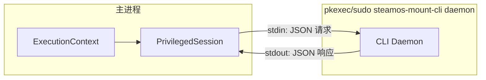
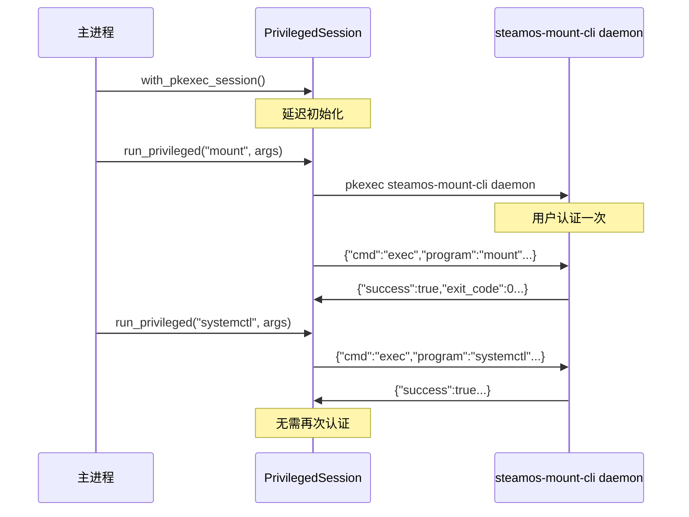

# steamos-mount 工具设计文档

[English](SOFTWARE_DESIGN.md)

本文档详细描述了 steamos-mount 工具的设计思路、技术架构及核心实现细节。本项目旨在解决 SteamOS 用户在游戏模式下挂载 NTFS/exFAT 磁盘并将其识别为 Steam 游戏库的痛点，重点关注**人体工程学（Ergonomics）**、**安全性**和**自动化体验**。

## 1. 设计目标与原则

- **人体工程学优先 (Ergonomics First)**：通过智能预设（Presets）隐藏复杂的 Linux 挂载参数，让非技术用户也能轻松配置。
- **Backend First 架构**：核心逻辑与 UI 解耦，通过统一的 Core Binary 支持 TUI、GUI (Desktop) 和 Decky Plugin (Game Mode) 多种前端。
- **安全性与稳定性**：
  - 使用 Rust 编写核心逻辑以确保内存安全。
  - 对 `/etc/fstab` 的修改必须是幂等的（Idempotent）且包含备份机制。
  - 智能处理“脏盘”状态，防止数据损坏。
- **SteamOS 原生兼容**：遵循 SteamOS 的不可变文件系统特性，利用 `/home` 目录和 Systemd 机制实现持久化。

---

## 2. 软件架构设计

采用 **Core-Client** 分离架构，核心逻辑下沉，UI 层只负责展示和交互。

### 2.1 技术栈

- **核心库 + CLI**: `Rust`
  - **职责**: 磁盘扫描 (`lsblk`)、Fstab 解析与写入、`ntfsfix` 修复、Steam VDF 注入、Systemd 控制。
  - **优势**: 高性能、类型安全、易于跨进程调用。
- **TUI (终端界面)**: `Rust` + `Ratatui`
  - **场景**: SSH 远程管理、Konsole、以及 Decky 插件内的终端保底方案。
- **Game Mode GUI**: `Python` (Decky Backend) + `React` (Frontend)
  - **场景**: 游戏模式下的原生体验，通过 `install.sh` 下载 `steamos-mount-cli` 进行交互（Decky CI 缺少 Rust 工具链）。
- **Desktop Mode GUI**: `Rust` + `Tauri`
  - **场景**: 桌面模式下的完整配置工具，UI 组件本地维护（不与 Decky 共享）。

```plaintext
steamos-mount/
├── .git/
├── .gitignore
├── mise.toml                  # [总管] 环境管理
├── Cargo.toml                 # [Rust Workspace] 聚合所有散落的 Cargo.toml
├── pnpm-workspace.yaml        # [JS Workspace] 聚合所有 package.json
├── pyproject.toml             # [Python Workspace] 聚合所有散落的 pyproject.toml
├── apps/                      # [可执行应用层]
│   ├── cli/                   # 命令行工具
│   ├── tauri-app/             # 桌面端 GUI
│   │   ├── src-tauri/         # [Rust] 依赖 packages/core
│   │   └── src/               # [React] 本地 UI 组件（不与 Decky 共享）
│   │
│   ├── decky-plugin/          # 游戏模式插件
│   │   ├── src/               # [React] 前端 UI
│   │   └── py_modules/        # [Python] Decky 的 Python 入口
│   │
│   └── tui-app/               # [Rust] 纯终端界面应用
│       └── src/               # 依赖 packages/core
│
└── packages/                  # [共享库层]
    └── core/                  # [Rust] 核心业务逻辑 (lsblk, fstab, mount)
```

### 2.2 数据流

1.  **扫描**: Core 调用 `lsblk` 获取 JSON 格式的磁盘信息。
2.  **呈现**: UI 读取 Core 返回的结构化数据（包含 Label, UUID, FSTYPE, MOUNTPOINT）。
3.  **配置**: 用户在 UI 选择磁盘和预设（Preset）。
4.  **执行**: Core 接收指令 -> 备份 fstab -> 写入 fstab -> 重载 Systemd -> 挂载 -> (可选) 注入 Steam 库 -> 重启 UI。

### 2.3 仓库说明（开发者）

- **主仓库**：https://github.com/aitiotekt/steamos-mount
- **Decky subtree 仓库**：https://github.com/aitiotekt/steamos-mount-decky
- **使用 subtree 的原因**：decky-plugin-database 的 submodules 只能指向仓库根目录，因此 Decky 插件以 git subtree 同步。
- **UI 组件**：Tauri 与 Decky 的 UI 不共享组件库，分别维护。

---

## 3. 核心方案细节

### 3.1 挂载点策略

- **路径规范**: 统一使用 `/home/deck/Drives/<Label_or_UUID>`
  - **为何不选 `/mnt`**: 系统更新会清空 `/mnt`，导致挂载点丢失。
  - **为何不选 `/run/media`**: 这是 `udisks2` 的动态挂载目录，且为 tmpfs（内存盘），无法配合 fstab 实现持久化，且容易产生权限冲突。
  - **优势**: `/home` 分区在 SteamOS 升级中保留，且 Flatpak 应用默认有访问权限。
  - **冲突处理**: 如果 Label 为空或重复，自动降级使用 UUID 前 8 位作为目录名。

### 3.2 磁盘标识符

- **推荐策略**: 提供 UUID 和 PARTUUID 两种选择，并在 UI 中提供说明。
  - **UUID (默认推荐)**: 绑定于文件系统。格式化后失效，但移动分区位置不失效。适合大多数用户。
  - **PARTUUID**: 绑定于分区表。格式化文件系统后依然有效（只要不删分区）。适合高级用户。
  - **注意**: 写入配置时必须转换为**小写**，以兼容 `/dev/disk/by-uuid/` 路径查找。

### 3.3 文件系统参数与预设 (Presets)

工具应该首先提供基于根据文件系统、设备介质、使用场景的预设；但高级用户可以手动微调参数，比如开关某个选项、调整参数值等。

#### 通用配置

- `uid=1000,gid=1000`: 强制将所有权映射给 `deck` 用户，解决 NTFS/exFAT 不支持 POSIX 权限导致 Steam 无法写入的问题。
- `umask=000`: 给予 777 权限，确保 Proton 兼容层无权限阻碍。
- `nofail`: 挂载失败时不阻塞系统启动。
- `rw,noatime`: 减少元数据写入。

#### 文件系统预设：

文件系统：ntfs

- `ntfs3`: 使用内核驱动，高性能。
- `prealloc`: (仅 NTFS) 预分配空间，减少碎片，优化大型游戏下载。

文件系统：exfat

- `exfat`: 使用 exFAT 驱动

#### 设备介质预设

设备介质：闪存

- `discard`: 开启 TRIM，延长 SSD 寿命。

设备介质：机械硬盘

暂无额外

#### 固定/可拔插设备类型预设：

设备类型：固定设备

- **场景**: 内置设备或长期连接的设备。
- **参数**:
  - `x-systemd.device-timeout=3s`: 快速跳过不存在的设备。

设备类型：可拔插设备

- **场景**: 需要频繁插拔的设备。
- **参数**:
  - `noauto`: **关键**。开机时不挂载，避免阻塞。
  - `x-systemd.automount`: **关键**。当访问挂载点时（如 Steam 扫描库）才触发挂载。
  - `x-systemd.idle-timeout=60s`: (可选) 无读写 60s 后自动卸载，降低直接拔卡导致脏盘的风险。

### 3.4 "脏盘" (Dirty Volume) 处理

这是提升人体工程学的关键点。NTFS 驱动在检测到 Dirty Bit（通常由 Windows 快速启动或强制关机导致）时会拒绝挂载。

- **策略**:
  1.  Core 尝试挂载 -> 失败。
  2.  Core 读取 `dmesg` 查找关键词 (`volume is dirty`, `force flag is not set`)。
  3.  **UI 反馈**: 弹窗提示用户“检测到磁盘未安全移除，是否尝试修复？”。
  4.  **修复**: 用户确认后，调用 `ntfsfix -d /dev/disk/by-uuid/<UUID>` 清除脏标记。
  5.  **重试**: 修复成功后自动重试挂载。
  6.  **错误处理**: 如果修复失败，Core 会记录错误日志，UI 可以显示错误信息，建议用户回到 windows 使用 `chkdsk` 工具修复。
- **警告**: `force` 参数虽然能强行挂载，但极易导致数据损坏，本项目**严禁**默认使用 `force`，必须通过修复流程解决。

### 3.5 提权会话模式 (Privilege Escalation Session)

单次用户操作涉及多个提权命令（挂载、fstab 写入、systemd 重载）时，通常需要多次认证提示。Session 模式通过启动单个提权 daemon 进程解决此问题。

#### 架构



#### 工作流程



#### 通信协议

通过 stdin/stdout 的 JSON-RPC 风格通信：

```json
// 请求类型
{"cmd":"exec","id":1,"program":"mount","args":["/dev/sda1","/mnt"]}
{"cmd":"write_file","id":2,"path":"/etc/fstab","content":"..."}
{"cmd":"copy_file","id":3,"src":"/etc/fstab","dst":"/etc/fstab.bak"}
{"cmd":"mkdir_p","id":4,"path":"/home/deck/Drives/GamesSSD"}
{"cmd":"shutdown"}

// 响应
{"id":1,"success":true,"exit_code":0,"stdout":"","stderr":""}
```

#### 孤儿进程防护

Daemon 在 Linux 上使用 `prctl(PR_SET_PDEATHSIG, SIGTERM)`，在父进程死亡时接收 SIGTERM 信号，确保自动清理。

#### 安全机制

> [!IMPORTANT]
> Daemon 实现了加密签名以防止通过 `/proc/PID/fd` 访问进行的未授权提权。

**威胁模型**：具有相同用户权限的恶意进程可能通过 `/proc/PID/fd` 访问 daemon 的 stdin/stdout 管道，从而绕过初始 `pkexec` 认证。

**缓解措施**：

1. **握手与密钥交换**：
   - Daemon 在启动时生成 32 字节随机密钥
   - 密钥通过 stdout 发送给父进程（只有父进程持有管道）
   
2. **HMAC-SHA256 签名请求**：
   ```json
   {"id":1,"hmac":"a1b2c3...","cmd":"exec","program":"mount",...}
   ```
   - 签名：`HMAC-SHA256(secret, id || cmd_json)`
   - Daemon 拒绝签名无效的请求

3. **防重放保护**：
   - 请求 ID 必须单调递增
   - Daemon 跟踪最后看到的 ID，拒绝 `id <= last_id` 的请求

## 4. 配置文件管理 (`/etc/fstab`)

虽然 `/etc` 是系统目录，但在 SteamOS 中 `fstab` 会被迁移保留。

### 4.1 写入规范

工具管理的条目必须包含特殊注释标记，以便于程序识别和更新，同时不破坏用户手动添加的条目。

```fstab
# /etc/fstab

# ... 系统原有配置 ...

# BEGIN STEAMOS-MOUNT-MANAGED
# Created by SteamOS Mount Tool. DO NOT EDIT THIS BLOCK MANUALLY.
UUID=1234-5678  /home/deck/Drives/GamesSSD  ntfs3  uid=1000,gid=1000,rw,umask=000,discard,prealloc,nofail  0  0
# END STEAMOS-MOUNT-MANAGED
```

- **FSCK 选项**: 设置为 `0 0`。Linux 下对 NTFS 的 fsck 支持极差，开启检查会导致启动卡死（dependency failed）。

---

## 5. Steam 游戏库注入

挂载成功后，需要让 Steam 识别该路径。桌面模式应用提供三种执行模式供用户选择。

### 5.1 库路径配置

在注入前，用户可以为每个挂载的驱动器配置 Steam 库路径：

- **默认路径**: `{挂载点}/SteamLibrary`（推荐）
- **自定义路径**: 用户指定的子目录

### 5.2 执行模式

#### 模式 1: 自动执行（推荐）

完全自动化的 VDF 修改，并恢复 Steam 状态。

- **文件路径**: `~/.local/share/Steam/steamapps/libraryfolders.vdf`
- **流程**:
  1.  记录当前 Steam 运行状态 (`pgrep -x steam`)。
  2.  调用 `steam --shutdown` 优雅关闭 Steam 并等待进程结束。
  3.  解析 VDF 文件，计算下一个可用的 `LibraryID`（数字字符串）。
  4.  注入新的库条目：
      ```json
      "{NEXTID}" {
          "path" "{库路径}"
          "label" ""
          "contentid" "0"
          "totalsize" "0"
          "apps" {}
      }
      ```
  5.  如果 Steam 之前正在运行，通过 `steam &` 重新启动。
- **优势**: 无需手动干预。

#### 模式 2: 半自动执行

打开 Steam 设置，由用户引导式手动添加。

- **流程**:
  1.  调用 `steam steam://open/settings/storage` 打开存储设置。
  2.  UI 将挂载路径复制到剪贴板以便粘贴。
  3.  用户手动点击 `+` 添加库文件夹。
- **优势**: 无需重启 Steam，用户保持完全控制。

#### 模式 3: 手动执行

用户独立处理所有操作。

- **流程**:
  1.  UI 显示挂载路径和简要说明。
  2.  用户手动打开 Steam 设置 → 存储 → 添加库文件夹。
- **优势**: 最大程度的用户控制，无自动化操作。

---

## 6. 用户体验流程 (User Journey)

1.  **启动**: 用户打开 Decky 插件或桌面应用。
2.  **概览**: 看到当前已挂载和未挂载的分区列表（显示 Label, Size, Type）。
3.  **配置**:
    - 选中一个 NTFS 分区。
    - 选择预设方案（如“外接游戏盘”）。
    - (高级选项) 微调挂载参数。
4.  **应用**: 点击“挂载并添加至 Steam”。
    - _系统检查_: 是否 Dirty？-> 提示修复。
    - _执行_: 写入 fstab -> mount。
    - _注入_: 提示“即将重启界面” -> 注入 VDF -> 重启。
5.  **完成**: 重启后，新磁盘直接出现在 Steam 存储空间中。
